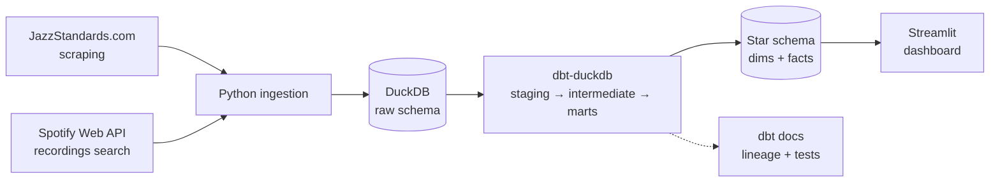

# 🎷 Jazz Standards Repertoire Analytics

> Analyzing the canon of jazz standards through modern data engineering.

**Status: 🚧 Work in progress** — actively built in public. See the [roadmap](#roadmap) for current state.

An end-to-end analytics engineering project that ingests, models, and visualizes data about jazz standards: which tunes form the canon, who recorded them, and how the repertoire evolved across eras. Built as a real-world application of the modern data stack — and as a way to connect my two daily disciplines: data and jazz guitar.

---

## Architecture



**Stack:** Python · DuckDB · dbt (dbt-duckdb) · Streamlit · Git

| Layer | Tool | Why |
|---|---|---|
| Ingestion | Python (`requests`, `beautifulsoup4`, `spotipy`) | Scraping the standards canon + Spotify recordings metadata |
| Storage | DuckDB | Local, file-based, zero-infra analytical database |
| Transformation | dbt-duckdb | Tested, documented, layered SQL models |
| Serving | Streamlit | Interactive dashboard reading directly from the marts |

## Data model

The marts layer implements a dimensional **star schema**:

- `fct_recordings` — grain: one recording of a standard by an artist
- `dim_standards` — title, composer, year, original show/film
- `dim_artists` — name, era, primary instrument
- `dim_dates` — recording date attributes

All models ship with schema tests (`not_null`, `unique`, relationship tests) and column-level documentation rendered via `dbt docs`.

## Project structure

```
jazz-standards-analytics/
├── ingestion/            # Python scripts: scraping, Spotify API, load to DuckDB
├── dbt_project/
│   └── models/
│       ├── staging/      # 1:1 with sources — cleaning, casting, renaming
│       ├── intermediate/ # joins, deduplication of recording versions
│       └── marts/        # star schema: dims + facts
├── dashboard/            # Streamlit app
├── data/                 # DuckDB database file (gitignored)
└── docs/                 # architecture diagram, notes
```

## Roadmap

Progress is tracked here as steps are completed — dates mark actual completion.

- [x] **01 · Design** — project scope, architecture and dimensional model · *done 2026-06-10*
- [x] **02.1 · Ingestion — standards** — scrape the JazzStandards.com canon → `raw.standards` · *done 2026-06-24*
- [x] **02.2 · Ingestion — recordings** — Spotify Web API search → `raw.recordings` · *done 2026-06-24*
- [ ] **03 · Staging** — dbt staging layer, source definitions, basic tests
- [ ] **04 · Marts** — intermediate models + star schema with relationship tests
- [ ] **05 · Docs & metrics** — dbt docs, lineage, most-recorded standards, longevity score
- [ ] **06 · Dashboard** — Streamlit app deployed on Streamlit Community Cloud
- [ ] **07 · Write-up** — screenshots, polish, blog post

## Questions this project answers

- Which standards are the most recorded — and does the "canon" match what jam sessions actually call?
- How does a composer's footprint evolve over decades (Ellington vs. Porter vs. Monk)?
- Which artists have the widest repertoire overlap, and who recorded the deep cuts?

## Running locally

> ⚙️ Setup instructions will land here once the ingestion pipeline is merged (step 02). The short version: `pip install -r requirements.txt`, add Spotify API credentials to `.env`, run the ingestion scripts, then `dbt build` inside `dbt_project/`.

## About

I'm [Mathias Berg](https://mbergr.github.io/portfolio/), a Data Analyst in Stuttgart moving into analytics engineering. I also play jazz guitar — this project analyzes the same repertoire I practice.

📫 [LinkedIn](https://www.linkedin.com/in/mbergr/) · [Blog](https://mbergr.github.io/portfolio/blog/) · mathias.berg.1992@gmail.com
